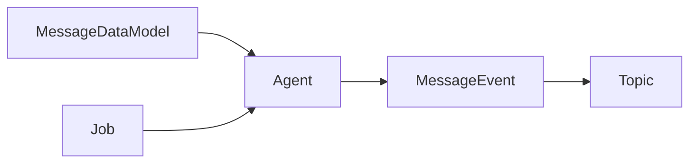

# InsightQL
simple, portable stream processing engine.  
inspired by Robinhood's [Faust](https://faust.readthedocs.io/en/latest/introduction.html)

## Project vision

**Distributed**  
Simple integration into microservices because of the independence of each **insightQL** instance. Deploy as many as you need! 

**Read optimized**  
Designed to perform complex read queries, and is not designed to execute writes and updates to databases.

**Flexible**  
Freedom of creating multiple consumers and subscribing to as many topics as needed.

**Single instance**  
No need to distribute the preparation and execution of asynchronous jobs. This event processing engine assumes both roles.

**Precomputed**  
Contents of cache can be computed before it is needed.

**Clever caching**  
Executed queries are cached so that reads from this engine are served quickly. We have default in-memory key/value store but users can also integrate a redis configuration.

**Fresh data**  
Event-driven architecture allows the data in our cache to remain fresh and consistently synchronized as the data changes.

## Desired use cases
- Event processing
- Distributed joins & aggregations
- Asynchronous job execution
- Data denormalization
- Distributed computing

## Key highlights

**Event process pipeline**  
InsightQL is a great way to coordinate and execute event-driven jobs. The way our system works is like this: 

As we can see, an Agent should always be fixed to a specific message event in the Kafka topic (i.e OrderPlaced, OrderDelivered). This structure allows a consistent serialization of messages with InsightQL and distributed processing of message events. We shouldn't be using a model meant for placed orders on messages about delivered orders. This atomicity is enforced by validating the Kafka message header attribute `event-type` to the MessageEvent parameter passed into the Agent.  
This makes sure that we **DO NOT** use the **_single user-defined MessageDataModel_** to **serialize** several **_different types of messages_** from a kafka topic.


**Centralized Message Data**  
InsightQL takes your data model to serialize the messages consumed by using a single instance of the data model provided. This greatly resembles the Singleton pattern. The single instance is used to store valid serialized message data and wipe all data after Agent job execution for easy reuse. This simulates an in-memory cache with cache invalidation for each Agent to use as they prepare, execute, and cleanup a job.

This single instance works well with our system because they are assigned *one per agent* and *one agent per message event* (as mentioned earlier: ensures consistent serialization of messages), another thing that allows this single instance to thrive is the sequential events from Kafka that mitigate any race conditions on our data object. Our `CentralizedSingleInstance` type defines how our data objects work.
```typescript
export type CentralizedSingleInstance = {
  [keys: string]: any;

  /**
   * Helps ensure that this single instance is cleared and ready for the next message serialization.
   */
  clearInstance(): void;
  /**
   * Helps ensure that the message serialization was successful.
   * @returns boolean
   */
  validInstance(): boolean;
};
```
This single instance data object for each agent has many advantages to our engine:
- Absolute control over the data flow coming from messages.
- Centralized cache with easy access.
- Lightweight and optimized performance for job storage as creating multiple instances of your data model for each message recieved could be costly.

## Benchmarks

This is the estimated performance overhead for some of InsightQL's processes and workflow. 

**Event Message Processing (Single Agent)**: 0.017ms

**Event Message Processing (Multiple Agents: 5)**: 0.038ms

